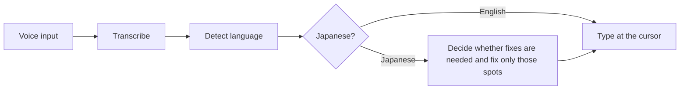

# fcitx5-voice-ja

[日本語](README.md) | English

Offline Japanese and English voice input for Linux. It uses speech recognition (STT, speech-to-text) to type what you say at the cursor.
All transcription runs on your own PC, and no audio is sent to the cloud. After a one-time model download, it works without an internet connection.

It runs as an add-on for the fcitx5 input method framework. Press the trigger key in any input field that fcitx5 can type into, and dictation starts right there. Your input method stays as it is.

It supports Arch Linux, Debian, Ubuntu, and Fedora, on GNOME or KDE, under Wayland or X11.

You do not have to speak punctuation. Pauses and the shape of the phrase decide where Japanese commas (、) and periods (。) go.
Japanese homophone mix-ups such as 機会 and 機械 are reviewed against the text before the cursor, and only clear mistakes are fixed.
Japanese or English is detected from what you say, so there is nothing to switch.
While you speak, the text so far appears near the cursor, and long dictations of several minutes are typed in piece by piece as you go.

## Installation

fcitx5 and PipeWire must be running.

### From the AUR

```sh
paru -S fcitx5-voice-ja   # or: yay -S fcitx5-voice-ja
```

### From a deb or rpm

Build the package on a machine with docker or podman, then install it. See `packaging/README.md` for details.

```sh
packaging/build.sh deb    # defaults to debian:trixie
packaging/build.sh rpm    # defaults to fedora:42
sudo apt install ./packaging/dist/fcitx5-voice-ja_*.deb
sudo dnf install ./packaging/dist/fcitx5-voice-ja-*.rpm
```

The packages do not include the models. After installing from the AUR, a deb, or an rpm, run the following as your desktop user.

```sh
voice-jad-download-models
systemctl --user enable --now voice-jad.socket
busctl --user call org.fcitx.Fcitx5 /controller org.fcitx.Fcitx.Controller1 Restart
voice-ja-capslock-menu apply   # on GNOME, to use CapsLock as the Menu key
```

### From the repository

```sh
./scripts/install.sh                   # remaps CapsLock to Menu (GNOME)
./scripts/install.sh --keep-capslock   # keeps CapsLock as it is
```

The script builds the project, downloads the models, enables the systemd socket, and restarts fcitx5.
The build needs `base-devel`, `cargo`, `clang`, `cmake`, `extra-cmake-modules`, and `gettext`.
The models are stored in `~/.local/share/voice-jad/models/`.

After installing, check the connection to the daemon.

```sh
voice-ja-ctl hello
voice-ja-ctl status
```

## Configuration

### Trigger key

The default trigger key is `Menu`, and CapsLock is used as the Menu key.
On Wayland fcitx5 cannot turn the CapsLock state back off, so the desktop remaps the key instead.

| Environment | How to remap |
| --- | --- |
| GNOME | The installer adds the XKB option `caps:menu`. Run `voice-ja-capslock-menu revert` to undo it |
| X11 | `setxkbmap -option caps:menu` (lasts until you log out) |
| KDE | In System Settings, open Keyboard, then Keyboard Shortcuts, then Caps Lock behavior, and make CapsLock an additional Menu key |

If `🎙️` appears near the cursor when you press the trigger key in an input field, the key reaches fcitx5.

- A short press starts recording, and a second press stops it and types the text.
- A long press records while you hold the key and types the text when you release it.
- Escape during recording discards the part not yet typed.

### fcitx5 settings

Open `fcitx5-configtool`, go to Addons, and select "Japanese Voice Input".
The settings file is `~/.config/fcitx5/conf/voiceja.conf`.

| Key | Default | Description |
| --- | --- | --- |
| TriggerKey | Menu | Key that starts and stops recording |
| CancelKey | Escape | Key that discards the recording |
| TapThresholdMs | 250 | A shorter press keeps recording on; a longer press records while held |
| Language | auto | One of auto, ja, en |
| SocketPath | empty | When empty, `$XDG_RUNTIME_DIR/voice-jad.sock` is used |
| ShowStatus | True | Shows `🎙️`, the partial text, and `…` near the cursor |

### Daemon settings

Write them in `~/.config/voice-jad/config.toml`. See `daemon/config.example.toml` for an example.

| Key | Default | Description |
| --- | --- | --- |
| target | default microphone | PipeWire source name. While it is unplugged, the default microphone is used |
| partial_interval_ms | 500 | Partial text update interval in milliseconds. 0 hides partial text |
| commit_after_seconds | 60 | Length of a long recording before its earlier part is typed, in seconds |
| max_seconds | 120 | Length at which speech without pauses is cut, in seconds |
| max_recording_seconds | 600 | Length at which recording stops automatically, in seconds |
| correction.enabled | true | Whether to correct homophones. Correction uses about 1.1 GB more memory |
| correction.judge_margin | 2.0 | Log-likelihood difference a candidate fix needs to be accepted. Higher means fewer fixes |

```toml
target = "alsa_input.example"
partial_interval_ms = 0

[correction]
enabled = false
```

Correction needs a CPU with AVX2, FMA, F16C, and BMI2. It turns itself off on other CPUs or when the correction models are missing.

Restart the daemon after changing settings. Logs are available through `journalctl`.

```sh
systemctl --user restart voice-jad.service
journalctl --user -u voice-jad.service -f
```

## Architecture



1. The trigger key starts recording from the microphone.
2. The audio is transcribed in Japanese and English at the same time.
3. The spoken language is decided from the two results. When the language is fixed in the settings, only that language is transcribed and no detection runs.
4. For Japanese, the text is checked for spots that need fixing, such as homophone mix-ups, and only those spots are fixed. English is not corrected.
5. The final text is typed at the cursor.

## License

fcitx5-voice-ja itself is released under the MIT License (`LICENSE`).
See `THIRD_PARTY_NOTICES.md` for the licenses of the bundled libraries, downloaded models, and embedded dictionary.
