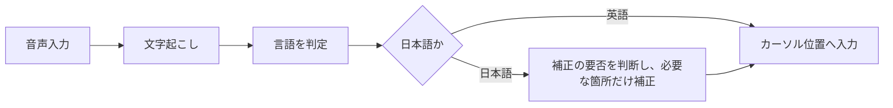

# fcitx5-voice-ja

[日本語](README.md) | [English](README.en.md)

> Offline Japanese and English voice input (speech-to-text dictation) for Linux, running as an fcitx5 add-on. See the [English README](README.en.md).

Linuxで使える、日本語と英語の音声入力です。音声認識（STT、Speech-to-Text）で話した内容をカーソル位置へ入力します。
音声の文字起こしはすべて手元のPCで行い、クラウドへ音声を送りません。モデルを一度ダウンロードすれば、インターネットに接続していなくても使えます。

入力メソッドフレームワークfcitx5のアドオンとして動作します。トリガーキーを押すと、fcitx5で文字を打てる入力欄ならその場で音声入力が始まります。入力メソッド自体は切り替えません。

Arch Linux、Debian、Ubuntu、Fedoraに対応し、GNOMEやKDEのデスクトップ、WaylandとX11のどちらでも使えます。

話の間（ま）と言い回しから「、」と「。」を補うので、句読点を口で言う必要はありません。
「機会」と「機械」のような同音異義語の取り違えも、カーソルより前の文章を手がかりに見直し、明らかに直したほうがよい箇所だけを直します。
日本語か英語かは話した内容から自動で判定するので、切り替えの操作もいりません。
話している間は途中までの内容がカーソルの近くに表示され、数分にわたる長い話も、話しながら少しずつ入力されていきます。

## インストール

fcitx5とPipeWireが動作している環境が前提です。

### AURから

```sh
paru -S fcitx5-voice-ja   # または yay -S fcitx5-voice-ja
```

### debまたはrpmから

dockerまたはpodmanと`cargo`のあるマシンでパッケージをビルドしてインストールします。詳細は`packaging/README.md`を参照してください。

```sh
packaging/build.sh deb    # 既定はdebian:trixie
packaging/build.sh rpm    # 既定はfedora:44
sudo apt install ./packaging/dist/fcitx5-voice-ja_*.deb
sudo dnf install ./packaging/dist/fcitx5-voice-ja-*.rpm
```

パッケージにはモデルが含まれません。AUR、deb、rpmのいずれでも、インストール後にデスクトップのユーザーとして次を実行してください。

```sh
voice-jad-download-models
systemctl --user enable --now voice-jad.socket
busctl --user call org.fcitx.Fcitx5 /controller org.fcitx.Fcitx.Controller1 Restart
voice-ja-capslock-menu apply   # GNOMEでCapsLockをMenuキーにする場合
```

### リポジトリから

```sh
./scripts/install.sh                   # CapsLockをMenuキーに読み替える（GNOME）
./scripts/install.sh --keep-capslock   # CapsLockをそのまま残す
```

ビルド、モデルのダウンロード、systemd socketの有効化、fcitx5の再起動までをまとめて行います。
ビルドには`base-devel`、`cargo`、`clang`、`cmake`、`extra-cmake-modules`、`gettext`が必要です。
モデルは`~/.local/share/voice-jad/models/`へ保存されます。

インストール後は次のコマンドでデーモンとの接続を確認できます。

```sh
voice-ja-ctl hello
voice-ja-ctl status
```

## 設定

### トリガーキー

既定のトリガーキーは`Menu`で、CapsLockをMenuキーとして使います。
WaylandではfcitxがCapsLockの状態を戻せないため、OS側でMenuキーへ読み替えます。

| 環境 | 読み替え方法 |
| --- | --- |
| GNOME | インストーラーがXKBオプション`caps:menu`を追加する。戻すには`voice-ja-capslock-menu revert` |
| X11 | `setxkbmap -option caps:menu`（ログアウトまで有効） |
| KDE | システム設定のキーボード、キーボードショートカット、CapsLockの動作から、CapsLockを追加のMenuキーにする |

入力欄でトリガーキーを押してカーソル付近に`🎙️`が出れば、キーはfcitx5まで届いています。

- 短く押すと録音を開始し、もう一度押すと終了して入力します。
- 長押しすると押している間だけ録音し、離すと入力します。
- 録音中にEscapeを押すと、未入力の部分を取り消します。

### fcitx5側の設定

`fcitx5-configtool`のアドオン（Addons）から「Japanese Voice Input」を選びます。
設定ファイルは`~/.config/fcitx5/conf/voiceja.conf`です。

| 項目 | 既定値 | 内容 |
| --- | --- | --- |
| TriggerKey | Menu | 録音の開始と終了に使うキー |
| CancelKey | Escape | 録音中に押すと録音を取り消すキー |
| TapThresholdMs | 250 | これより短い押下は録音を維持し、長い押下は押している間だけ録音する |
| Language | auto | auto、ja、enのいずれか |
| SocketPath | 空 | 空の場合は`$XDG_RUNTIME_DIR/voice-jad.sock`を使う |
| ShowStatus | True | カーソル付近へ`🎙️`と途中経過、`…`を表示する |

### デーモン側の設定

`~/.config/voice-jad/config.toml`に書きます。設定例は`daemon/config.example.toml`にあります。

| 項目 | 既定値 | 内容 |
| --- | --- | --- |
| target | 既定のマイク | PipeWireのソース名。外れている間は既定のマイクで録音する |
| partial_interval_ms | 500 | 途中経過の更新間隔（ミリ秒）。0で表示しない |
| commit_after_seconds | 60 | 長い録音で、途中の部分を入力するまでの長さ（秒） |
| max_seconds | 120 | 間のない発話を区切る長さ（秒） |
| max_recording_seconds | 600 | 録音が自動で終了する長さ（秒） |
| correction.enabled | true | 同音異義語補正を使うか。使うとメモリが約1.1GB増える |
| correction.judge_margin | 2.0 | 補正候補の採用に必要な対数尤度の差。大きいほど採用が減る |

```toml
target = "alsa_input.example"
partial_interval_ms = 0

[correction]
enabled = false
```

補正にはAVX2、FMA、F16C、BMI2に対応したCPUが必要で、非対応のCPUや補正用モデルがない場合は自動で無効になります。

設定を変えたらデーモンを再起動します。ログは`journalctl`で確認できます。

```sh
systemctl --user restart voice-jad.service
journalctl --user -u voice-jad.service -f
```

## アーキテクチャ



1. トリガーキーで録音を始め、マイクから音声を取り込みます。
2. 音声を日本語と英語の両方で同時に文字起こしします。
3. 2つの結果から、話していた言語を判定します。設定で言語を固定している場合は、その言語でだけ文字起こしし、判定はしません。
4. 日本語の場合は、同音異義語の取り違えなどで補正が必要な箇所がないかを判断し、必要な箇所だけ補正します。英語は補正しません。
5. 確定した文章をカーソルのある場所へ入力します。

## ライセンス

fcitx5-voice-ja本体はMITライセンスです（[`LICENSE`](LICENSE)）。
同梱ライブラリ、ダウンロードするモデル、組み込んだ辞書のライセンスは[`THIRD_PARTY_NOTICES.md`](THIRD_PARTY_NOTICES.md)を参照してください。
