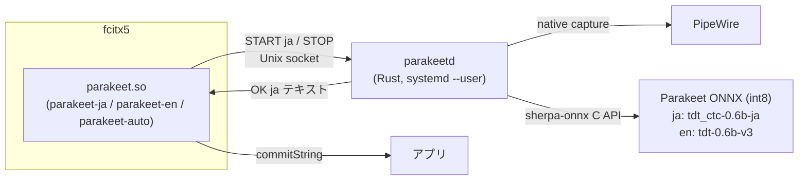

# fcitx5-parakeet

fcitx5 の入力メソッドとして選べる、NVIDIA Parakeet（sherpa-onnx）による完全ローカル音声入力。
日本語、英語、自動判別（日英どちらを話しても可）の 3 つの入力メソッドを提供し、karukan / mozc などの
キーボード入力メソッドと同じグループに並べて通常のホットキーで切り替えて使う。



- `fcitx5/`：C++ アドオン。トリガーキー以外のキーはアプリへ素通しするので、
  音声 IM を選んでいる間も普通にキーボード入力できる。IM 名（`parakeet-ja` / `-en` / `-auto`）が
  デーモンへ渡す言語になる。`fcitx5/icons/hicolor/` のパネル用アイコン（PNG、コミット済み）も入れる。
  作り直すときは `scripts/render-icons.sh`（`template.svg` のインコと国旗を rsvg-convert で描画）。
- `daemon-rs/`：Rust 製の `parakeetd` と `parakeet-ctl`。
  常駐する PipeWire ストリームで録音し、sherpa-onnx C API で認識する。
  Silero VAD で発話区間を検出し、雑音だけの録音は認識せず捨てる。
  モデルは常駐（2 モデルで約 1.7 GB RAM）し、socket activation で初回接続時に起動する。
- `systemd/`：`parakeetd.socket` / `parakeetd.service`（`--user`）。
- `packaging/arch/`：アドオンと Rust デーモンをまとめた PKGBUILD。
- `scripts/`：セットアップとスモークテスト。

## 使い方

1. fcitx5 の入力メソッド切替ホットキー（既定 `Ctrl+Space` で巡回）で
   **Parakeet 音声入力（自動、日英）**、**（日本語）**、**（英語）** のいずれかに切り替える。
   通常は「自動」だけをグループに入れておけばよく、日本語でも英語でも話したまま入力できる。
   言語を固定したいとき（固有名詞が多い英語、日本語の中の英単語など）は個別の IM を使う。
2. **Space を押し続けて話し、離す**（push-to-talk）。
   デーモンが最初の音声サンプルを受け取ると、カーソル付近に `🎙️` が出てパネルのアイコンが赤くなる。
   常駐ストリームの録音開始は実測 2～35 ms であり、この表示を合図に話せば冒頭が切れない。
   離すと `…`（認識中）に変わり、認識結果がその場に確定入力される。
3. Space を短く叩くと（既定 250 ms 未満）録音ではなく普通のスペースが入る。
   録音中の `Escape` でキャンセル。
4. 他のキーはそのままアプリへ届く。日本語のかな漢字変換をしたいときは karukan に戻す。

パネル（GNOME の kimpanel、トレイ）のアイコンは Parakeet の名にちなんだインコ。右下の国旗が言語を示し
（日本語 = 日の丸、英語 = 星条旗、自動 = 国旗なし）、背景は**録音中は赤**、**認識中は橙**に変わる。
カーソル付近には録音中 `🎙️`、認識中 `…` だけを出す（文字列は出さない）。`🎙️` と赤いアイコンは
デーモンが録音開始を確認してから出る。アイコンが解決できない環境では
ラベル（声 / Vo / 声A）が表示される。

設定は `fcitx5-configtool` → 入力メソッド → Parakeet の設定から（`~/.config/fcitx5/conf/parakeet.conf`）。

| 項目 | 既定 | 説明 |
| --- | --- | --- |
| 録音の開始方法 | Push to talk | `Toggle` にすると押して開始、再度押して終了 |
| 録音キー | `space` | 複数指定可 |
| キャンセルキー | `Escape` | 録音中のみ効く |
| TapThresholdMs | 250 | これより短い押下は通常のキー入力 |
| SocketPath | 空 | 空なら `$XDG_RUNTIME_DIR/parakeetd.sock` |
| ShowStatus | True | カーソル付近の状態表示 |

## セットアップ（Arch Linux）

前提：`fcitx5` 5.1 以降、PipeWire、Rust 1.80 以降、`clang`、`cmake`、`extra-cmake-modules`、`gettext`。

```sh
scripts/install.sh
```

内部で行うこと（個別に実行してもよい）:

```sh
( cd packaging/arch && makepkg -si )             # アドオン、Rust デーモン、sherpa-onnx CPU ライブラリ
scripts/download-models.sh                        # ~/.local/share/parakeetd/models/
systemctl --user daemon-reload
systemctl --user enable --now parakeetd.socket
busctl --user call org.fcitx.Fcitx5 /controller org.fcitx.Fcitx.Controller1 Restart
python3 scripts/fcitx5-register.py                 # 現在のグループへ ja / en / auto を追加
```

en モデルは omp のキャッシュ（`~/.omp/agent/cache/tiny-models/csukuangfj/…v3-int8`）があればシンボリックリンクで共有する。

### parakeetd の設定

`~/.config/parakeetd/config.toml`（雛形：`daemon-rs/config.example.toml`）。
マイクを既定ソース以外にしたい場合は `target = "<pactl list sources short のノード名>"` とする。
VAD を切るなら `vad_model = ""` とする。
変更後は `systemctl --user restart parakeetd.service` で反映する。

```sh
parakeet-ctl status                 # recording=0 loaded=ja,en languages=ja,en
parakeet-ctl rec ja --seconds 5     # マイクから 5 秒録音して認識結果を表示
journalctl --user -u parakeetd.service -f
```

### 自動判別（auto）の仕組み

`auto` では日本語モデルと英語モデルの両方で同時に認識する（所要時間は 1 モデル分）。
英語モデル（NeMo transducer）はトークンごとの対数確率を返すので、その平均が `threshold`（既定 -0.35）以上なら
英語の結果を、そうでなければ日本語の結果を採用する。手元の日英クリップでは英語音声で約 -0.02〜-0.06、
日本語音声で約 -0.7〜-1.0 と明確に分かれる。日本語モデル側は英語音声にカタカナを出すので判別材料にならない。
確定時には判別した言語も返るため、英語なら前の単語との間にスペースを補う処理も自動で効く。

```toml
[auto]
detector = "en"     # 確信度を持つ側（nemo_transducer モデル）
fallback = "ja"     # 確信度が低いときに採用する側
threshold = -0.35   # detector の平均トークン対数確率のしきい値
```

## プロトコル（parakeetd）

1 行 1 メッセージのテキスト。`<id> <CMD> [引数]` に対して `<id> OK [payload]` か `<id> ERR <理由>`。

| コマンド | 応答 |
| --- | --- |
| `HELLO` | `OK parakeetd <version>` |
| `LOAD <lang>` | モデル読込完了で `OK`（`auto` は両モデル） |
| `START <lang>` | マイクから最初のサンプルが届いた時点で `OK`。`<lang>` は `ja` / `en` / `auto` |
| `STOP` | 認識完了で `OK <lang> <テキスト>`。`auto` のときは判別した言語が入る。テキストは空のことがある |
| `CANCEL` | `OK` |
| `STATUS` | `OK recording=<0/1> loaded=<…> languages=<…>` |

録音は同時に 1 本。`START` した接続が切れると録音は破棄される。VAD が発話を検出しない録音（無音または雑音のみ）は認識せず空文字を返し、検出した場合は発話区間の前後 0.3 秒を含めて認識する。

## 開発

```sh
cd daemon-rs
SHERPA_ONNX_LIB_DIR=/path/to/sherpa-onnx/lib cargo build --release --locked
cd ../fcitx5
cmake -S . -B build -DCMAKE_BUILD_TYPE=Release -DCMAKE_INSTALL_PREFIX=/usr -DBUILD_TESTING=ON
cmake --build build
```

### 統合テスト

GUI なしで経路全体を確認する 2 通り。どちらも仮想オーディオデバイスを使う。

```sh
pactl load-module module-null-sink sink_name=parakeet_test
pactl load-module module-remap-source master=parakeet_test.monitor source_name=parakeet_src
```

1. `fcitx5/test/testparakeet`：fcitx5 のテストフロントエンドでアドオンをインプロセス実行し、
   タップ→スペース確定、他キー素通し、長押し→確定を検証する。
   `daemon-rs/target/release/parakeetd -v --socket /tmp/pk.sock --config <target = "parakeet_src" を書いた toml>` を別に起こしておく。

   ```sh
   PARAKEET_TEST_SOCKET=/tmp/pk.sock PARAKEET_TEST_SINK=parakeet_test PARAKEET_TEST_LANG=en \
   PARAKEET_TEST_WAV=en.wav PARAKEET_TEST_HOLD_SEC=5 \
   PARAKEET_TEST_EXPECT="Ask not what your country can do for you, ask what you can do for your country." \
   fcitx5/build/test/testparakeet
   ```

   `en.wav` は `https://huggingface.co/csukuangfj/sherpa-onnx-nemo-parakeet-tdt-0.6b-v3-int8/resolve/main/test_wavs/en.wav`。
   日本語は `models/…-ja-35000-int8/test_wavs/*.wav`（`EXPECT` は省略。認識結果が録音開始位置で揺れるため）。

2. `scripts/fcitx5-smoke.py`：**稼働中の fcitx5** に D-Bus で専用の入力コンテキストを作り、
   インストール済みアドオンと systemd 側の parakeetd を通して確定文字列を受け取る。

   ```sh
   pactl set-default-source parakeet_src
   python3 scripts/fcitx5-smoke.py --lang ja --wav test_ja_1.wav --sink parakeet_test --hold 14
   python3 scripts/fcitx5-smoke.py --lang auto --wav en.wav --sink parakeet_test --hold 5
   pactl set-default-source <元のマイク>
   ```

## 既知の制約

- デーモンへの要求にはタイムアウトがある（LOAD/STOP 60 s、START 10 s）。超過時はカーソル付近に
  `Parakeet: timeout` と出て `… 認識中` 表示は消える。デーモン側の例外も `ERR` として返る。
- 英語 IM は直前の文字が空白でなければ先頭にスペースを補う（サラウンディングテキスト対応アプリのみ）。
- reset()（アプリのカーソル移動などで呼ばれる）では録音を止めない。録音が破棄されるのは
  フォーカス喪失または IM 切替（deactivate）のみ。
- 認識は発話終了後にまとめて行う（ストリーミング表示なし）。
  CPU の int8 モデルでは、5 秒の発話が離してから約 0.3 秒で確定する。
- マイクは PipeWire の常駐ストリームを録音時だけ有効化する。
  手元の環境では、録音開始から最初のサンプル到着まで初回 35 ms、以降 2 ms だった。
- 日本語モデル（ReazonSpeech 学習）の句読点は付いたり付かなかったりする。
  英語モデルは大文字と句読点を出力する。
- CUDA 実行は設定できるが、8 GB GPU ではモデルと実行領域が約 5.5 GB を占めるため既定にしていない。
